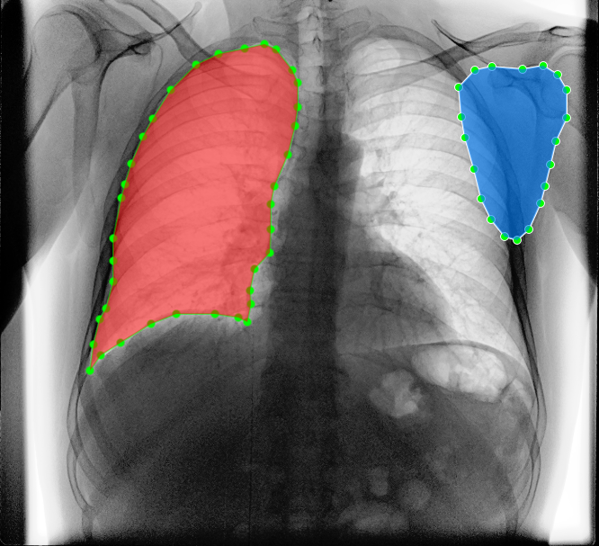
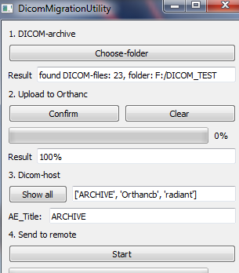
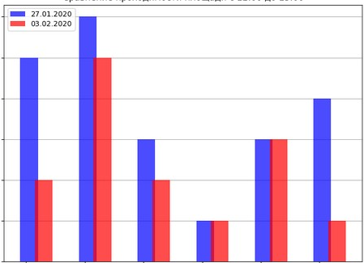

<!DOCTYPE html>
<html lang="ru">
  <head>
    <meta charset="utf-8">
    <meta name="viewport" content="width=device-width, initial-scale=1, shrink-to-fit=no">
    <link rel="stylesheet" href="https://maxcdn.bootstrapcdn.com/bootstrap/4.0.0/css/bootstrap.min.css" integrity="sha384-Gn5384xqQ1aoWXA+058RXPxPg6fy4IWvTNh0E263XmFcJlSAwiGgFAW/dAiS6JXm" crossorigin="anonymous">
    <link rel="stylesheet" href="css/custom.css">
    <title>Tehnix53.github.io | Python dev</title>
  </head>
  <body>

    <section class="promo dark-bg pt-2 pb-5">
      

        <nav class="navbar navbar-expand-lg mb-5 navbar-dark">
          <a href="#" class="navbar-brand logo d-flex align-items-center text-white text-decoration-none align-content-start">
            

              
            

            

              
Tehnix53.github.io

              
Python dev

            

          </a>
          <button class="navbar-toggler navbar-light" type="button" data-toggle="collapse" data-target="#navbarNav" aria-controls="navbarNav" aria-expanded="false" aria-label="Toggle navigation">
            
          </button>
          

            <ul class="nav m-auto">
              <li class="nav-item mx-3">
                <a href="#story" class="nav-link text-muted link-border-bottom">Моя история</a>
              </li>
              <li class="nav-item mx-3">
                <a href="#projects" class="nav-link text-muted link-border-bottom">Мои работы</a>
              </li>
              <li class="nav-item mx-3">
                <a href="#contact" class="nav-link text-muted link-border-bottom">Сотрудичество</a>
              </li>
            </ul>
            <ul class="nav ml-auto">
              <li class="nav-item mx-3">
                <a href="#" class="nav-link text-white link-border-bottom">Github</a>
              </li>
              <li class="nav-item mx-3 mr-0">
                <a href="#contact" class="nav-link text-white link-border-bottom">Написать мне</a>
              </li>
            </ul>
          

        </nav>

        

          

            <h1 class="h1 font-weight-bold font-color-green mb-4">Hello! Меня зовут Александр </h1>
            
Я&nbsp;&mdash; Python developer, Data Scientist, занимаюсь разработкой бекенда, в том числе AI & ML-based решений. &nbsp;

            <a href="#contact" class="btn btn-success btn-green">Написать мне</a>
          

        

      

    </section>

    <section class="story container py-5 text-center" id="story">
      <h2 class="h1 font-weight-bold mt-4 mb-3 mb-sm-5 pb-3">Моя история</h2>
      

        

          
Я занимаюсь ремонтом медицинской техники, параллельно изучаю Python, нейронные сети, базы данных и Data Science. &nbsp; Работаю над проектом по искусственному интеллекту в медицине в своем стартапе.&nbsp;
              

          
Работаю со связкой Python+СУБД (PostgreSQL, MS SQL Server, Interbase/Firebird, SQLite), знаю основы HTML/CSS. &nbsp;Мне нравится использовать для бекенда фреймворки OpenCV, Tensorflow, Keras, для оформления работ PyQt, Flask и&nbsp;Bootstrap.

        

      

    </section>

    <section class="projects dark-bg pt-3 pt-sm-5 pb-3" id="projects">

      

        <h2 class="h1 font-weight-bold text-center mt-4 mt-sm-5 mb-0 mb-sm-4 pb-5">Мои работы</h2>
        

          

            
            
Бекенд AI-проекта по&nbsp;сегментации медицинских изображений&nbsp; Нейросеть архитектуры Unet&nbsp;, расчет сердечного индекса по бинарной маске. Фреймворки Keras/Tensorflow и OpenCv.&nbsp;

            

              <a href="https://github.com/tehnix53/Fluorography-Cardio-Index-Analysis" target="_blank" class="link link-green mr-4">Смотреть проект</a>
              <a href="https://github.com/tehnix53/Fluorography-Cardio-Index-Analysis" target="_blank" class="link">Исходный код</a>
            

          

          

            
            
Оконное приложение, работающее как плагин Orthanc сервера&nbsp; для массовой миграции&nbsp;DICOM изображений на удаленный сервер. Графическая оболочка на PyQt и библиотека Requests.

            

              <a href="https://github.com/tehnix53/Dicom-Migration-through-Orthanc" target="_blank" class="link link-green mr-4">Смотреть проект</a>
              <a href="https://github.com/tehnix53/Dicom-Migration-through-Orthanc" target="_blank" class="link">Исходный код</a>
            

          

          

            
            
 Онлайн-сервис по доставке еды. Веб интерфейс на Flask с использованием WTForms, Bootstrap. Связь с базой данных на Postgres через фреймворк SQLAlchemy.    

            

              <a href="https://github.com/tehnix53/Meal_Order_PostgreSQL" target="_blank" class="link link-green mr-4">Смотреть проект</a>
              <a href="https://github.com/tehnix53/Meal_Order_PostgreSQL" target="_blank" class="link">Исходный код</a>
            

          

          
          

            
            
Бекенд по анализу проходимости торговых площадей. Алгоритм расчета с использованием OpenCv, статисткика и анализ данных в Jupyter Notebook с Pandas и Matplotlib.

            

              <a href="https://github.com/tehnix53/Ritail" target="_blank" class="link link-green mr-4">Смотреть проект</a>
              <a href="https://github.com/tehnix53/Ritail" target="_blank" class="link">Исходный код</a>
            

          

        

      

    </section>

    <section class="goals container pt-3 pt-sm-5 pb-3">
      <h2 class="h2 font-weight-bold my-4">Мои цели</h2>
      

        

          
Мои ближайшие цели: более углубленное изучение нейронных сетей интеграция этих знаний в проекты, доведение проектов от пилота до "prod" с дальнейшей монетизацией.  Получить более глубокие знания в области ООП и архитектуры приложений. Интегрировать не менее 5 программных решений в сферу по ремонту медицинской техники. Изучить Kotlin.

        

      

    </section>

    <section class="goals container mb-5 pb-sm-5 pb-0" id="contact">
      <h2 class="h2 font-weight-bold my-4">Сотрудничество</h2>
      

        

          
Мне было бы интересно:

          <ul class="list-unstyled mb-4">
            
            </li>
            <li class="d-flex align-items-center align-content-start m-2" style="line-height: 24px;">
              
                <svg xmlns="http://www.w3.org/2000/svg" height="24" viewBox="0 0 24 24" width="24"><path d="M10 6L8.59 7.41 13.17 12l-4.58 4.59L10 18l6-6z"/><path d="M0 0h24v24H0z" fill="none"/></svg>
              
              Поучаствовать в хакатоне как backend-разработчик
            </li>
            <li class="d-flex align-items-center align-content-start m-2" style="line-height: 24px;">
              
                <svg xmlns="http://www.w3.org/2000/svg" height="24" viewBox="0 0 24 24" width="24"><path d="M10 6L8.59 7.41 13.17 12l-4.58 4.59L10 18l6-6z"/><path d="M0 0h24v24H0z" fill="none"/></svg>
              
              Принять участие в коммерческом проекте
            </li>
            <li class="d-flex align-items-center align-content-start m-2" style="line-height: 24px;">
              
                <svg xmlns="http://www.w3.org/2000/svg" height="24" viewBox="0 0 24 24" width="24"><path d="M10 6L8.59 7.41 13.17 12l-4.58 4.59L10 18l6-6z"/><path d="M0 0h24v24H0z" fill="none"/></svg>
              
              Попробовать разработать бэкенд мобильного приложения
            </li>
          </ul>
          

            

              

                <a href="https://vk.com/everythingend" class="btn btn-primary mb-3" target="_blank">Написать в ВК</a>
                <a href="https://teleg.run/Lesley85" class="btn btn-info mb-3" target="_blank">Написать в Telegram</a>
                <a href="mailto:tehnix53@gmail.com" class="btn btn btn-dark mb-3" target="_blank">Написать на почту</a>
              

            

          

        

      

    </section>

    <footer class="footer dark-bg">
      <nav class="container navbar ">
        <ul class="nav m-auto py-2">
          <li class="nav-item mx-3">
            Cделано в&nbsp;рамках курса Flask с&nbsp;нуля на&nbsp;Stepik. 
          </li>
        </ul>
      </nav>
    </footer>

    
    
    
  </body>
</html>

